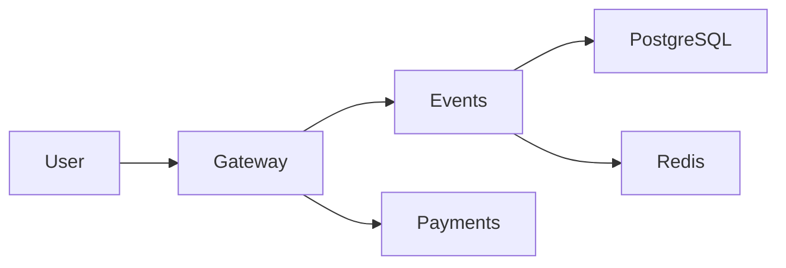

# Lab 1 — SRE Philosophy: Deploy, Break, Understand

## Student
- GitHub: `MiniMaxC`
- Branch: `feature/lab1`

---

# Task 1 — Deploy & Break QuickTicket

## 1.1 Deployment

QuickTicket was deployed with Docker Compose:

```bash
cd app
docker compose up --build -d
docker compose ps
```

All five required services were running:

```text
NAME             IMAGE                COMMAND                  SERVICE    CREATED         STATUS                   PORTS
app-events-1     app-events           "uvicorn main:app --…"   events     2 minutes ago   Up 2 minutes             0.0.0.0:8081->8081/tcp, [::]:8081->8081/tcp
app-gateway-1    app-gateway          "uvicorn main:app --…"   gateway    2 minutes ago   Up 2 minutes             0.0.0.0:3080->8080/tcp, [::]:3080->8080/tcp
app-payments-1   app-payments         "uvicorn main:app --…"   payments   2 minutes ago   Up 2 minutes             0.0.0.0:8082->8082/tcp, [::]:8082->8082/tcp
app-postgres-1   postgres:17-alpine   "docker-entrypoint.s…"   postgres   2 minutes ago   Up 2 minutes (healthy)   0.0.0.0:5432->5432/tcp, [::]:5432->5432/tcp
app-redis-1      redis:7-alpine       "docker-entrypoint.s…"   redis      2 minutes ago   Up 2 minutes (healthy)   0.0.0.0:6379->6379/tcp, [::]:6379->6379/tcp
```

The gateway health endpoint reported:

```json
{
  "status": "healthy",
  "checks": {
    "events": "ok",
    "payments": "ok",
    "circuit_payments": "CLOSED"
  }
}
```

---

## 1.2 Critical Path Verification

### List events

`GET /events` returned the seeded events successfully:

```json
[
  {
    "id": 1,
    "name": "Go Conference 2026",
    "venue": "Main Hall A",
    "date": "2026-09-15T09:00:00+00:00",
    "total_tickets": 100,
    "price_cents": 5000,
    "available": 100
  },
  {
    "id": 4,
    "name": "Python Workshop",
    "venue": "Lab 301",
    "date": "2026-09-22T14:00:00+00:00",
    "total_tickets": 25,
    "price_cents": 2000,
    "available": 25
  },
  {
    "id": 2,
    "name": "SRE Meetup",
    "venue": "Room 204",
    "date": "2026-10-01T18:00:00+00:00",
    "total_tickets": 30,
    "price_cents": 0,
    "available": 30
  },
  {
    "id": 5,
    "name": "Kubernetes Deep Dive",
    "venue": "Auditorium B",
    "date": "2026-10-10T10:00:00+00:00",
    "total_tickets": 80,
    "price_cents": 8000,
    "available": 80
  },
  {
    "id": 3,
    "name": "Cloud Native Summit",
    "venue": "Expo Center",
    "date": "2026-11-20T10:00:00+00:00",
    "total_tickets": 500,
    "price_cents": 15000,
    "available": 500
  }
]
```

### Reserve a ticket

```json
{
  "reservation_id": "a6896a5d-d415-4537-84eb-a6fe5637dda9",
  "event_id": 1,
  "quantity": 1,
  "total_cents": 5000,
  "expires_in_seconds": 300
}
```

### Pay for the reservation

```json
{
  "order_id": "a6896a5d-d415-4537-84eb-a6fe5637dda9",
  "event_id": 1,
  "quantity": 1,
  "total_cents": 5000,
  "status": "confirmed"
}
```

After payment, event 1 showed `available: 99`, confirming that the full list → reserve → pay path completed successfully.

---

## 1.3 Dependency Map



The gateway is the public entry point. Event listing and reservation requests are forwarded to the `events` service. `events` uses PostgreSQL for persistent event/order data and Redis for temporary reservation state. Payment requests go from the gateway to `payments`; after a successful charge, the gateway asks `events` to confirm the reservation.

---

## 1.4 Failure Exploration

| Component Killed | Events List | Reserve | Pay | Health Check | User Impact |
|---|---|---|---|---|---|
| `payments` | 200 OK | 200 OK | 502 Bad Gateway | 503 degraded, `payments: down` | Users can browse and reserve, but cannot complete payment |
| `events` | 502 Bad Gateway | 502 Bad Gateway | 500 after payment succeeded but confirmation failed | 503 degraded, `events: down` | Core ticket workflow unavailable; a charge may succeed without order confirmation |
| `redis` | 200 OK | 504 Gateway Timeout | 500 after payment succeeded but confirmation failed | 503 degraded via `events` | Browsing still works, but reservation and checkout state are unavailable |
| `postgres` | 502 Bad Gateway | 500 Internal Server Error | 500 after payment succeeded but confirmation failed | 503 degraded via `events` | Event data and persistent order confirmation are unavailable |

### Payments failure

```text
GET /events                      -> 200 OK
POST /events/1/reserve           -> 200 OK
POST /reserve/<id>/pay           -> 502 Bad Gateway
GET /health                      -> 503 Service Unavailable
```

```json
{
  "status": "degraded",
  "checks": {
    "events": "ok",
    "payments": "down",
    "circuit_payments": "CLOSED"
  }
}
```

### Events failure

```text
GET /events                      -> 502 Bad Gateway
POST /events/1/reserve           -> 502 Bad Gateway
POST /reserve/<existing-id>/pay  -> 500 Internal Server Error
GET /health                      -> 503 Service Unavailable
```

```json
{
  "detail": "Payment succeeded but confirmation failed — contact support"
}
```

### Redis failure

```text
GET /events                      -> 200 OK
POST /events/1/reserve           -> 504 Gateway Timeout
POST /reserve/<existing-id>/pay  -> 500 Internal Server Error
GET /health                      -> 503 Service Unavailable
```

The gateway reported the `events` service as down because it checks the events service health rather than Redis directly.

### PostgreSQL failure

```text
GET /events                      -> 502 Bad Gateway
POST /events/1/reserve           -> 500 Internal Server Error
POST /reserve/<existing-id>/pay  -> 500 Internal Server Error
GET /health                      -> 503 Service Unavailable
```

---

## 1.5 Load Generator

Healthy baseline:

```text
[10s] requests=45 success=45 fail=0 error_rate=0%
[20s] requests=90 success=90 fail=0 error_rate=0%
Done. total=135 success=135 fail=0 error_rate=0%
```

With `payments` stopped during the run:

```text
[10s] requests=27 success=25 fail=2 error_rate=7.4%
[20s] requests=54 success=51 fail=3 error_rate=5.5%
Done. total=62 success=57 fail=5 error_rate=8.0%
```

The error rate increased from 0% to 8%. Not all requests failed because event listing and reservation traffic can still work without the payment service. Throughput also fell because failed purchase requests spent time waiting for the unavailable downstream service.

---

# Task 2 — Graceful Degradation

The gateway was modified so an unreachable payment service returns an actionable 503 response instead of a generic 502.

## Code change

```diff
@@ -336,6 +336,18 @@ async def pay_reservation(reservation_id: str):
         raise HTTPException(504, "Payment service timeout")
     except httpx.HTTPStatusError as e:
         raise HTTPException(e.response.status_code, "Payment failed")
+    except httpx.ConnectError:
+        return JSONResponse(
+            status_code=503,
+            content={
+                "error": "payments_unavailable",
+                "message": (
+                    "Payment service is temporarily down. "
+                    "Your reservation is held — try again in a few minutes."
+                ),
+                "reservation_id": reservation_id,
+            },
+        )
     except Exception as e:
         log.error(f"payment error: {e}")
         raise HTTPException(502, "Payment service unavailable")
```

## Verification

Reservation still worked while payments was down:

```text
HTTP/1.1 200 OK
```

```json
{
  "reservation_id": "0a872376-8b4f-4ac0-a648-2455ee07c13d",
  "event_id": 1,
  "quantity": 1,
  "total_cents": 5000,
  "expires_in_seconds": 300
}
```

Payment returned:

```text
HTTP/1.1 503 Service Unavailable
```

```json
{
  "error": "payments_unavailable",
  "message": "Payment service is temporarily down. Your reservation is held — try again in a few minutes.",
  "reservation_id": "1c765318-ee1c-4f98-8b81-dc8041e57cb0"
}
```

After restarting payments, `/health` returned healthy again.

---

# Bonus Task — Resource Usage Under Load

Only QuickTicket containers are considered below; the unrelated `devops-intro-grafana-1` container was excluded.

## Idle

```text
NAME             CPU %   MEM USAGE
app-gateway-1    0.11%   38.03 MiB
app-events-1     0.10%   40.76 MiB
app-payments-1   0.11%   34.10 MiB
app-postgres-1   0.00%   25.69 MiB
app-redis-1      2.09%    4.86 MiB
```

## Under load

Representative sampled stats during active load:

```text
NAME             CPU %   MEM USAGE
app-gateway-1    2.31%   38.46 MiB
app-events-1     1.19%   41.23 MiB
app-payments-1   0.22%   34.56 MiB
app-postgres-1   0.46%   26.05 MiB
app-redis-1      0.23%    4.66 MiB
```

One normal 10 RPS run produced:

```text
Done. total=245 success=232 fail=13 error_rate=5.3%
```

## Fault injection

Payments was restarted with:

```bash
PAYMENT_FAILURE_RATE=0.3 PAYMENT_LATENCY_MS=500 docker compose up -d payments
```

The service confirmed:

```json
{
  "status": "healthy",
  "failure_rate": 0.3,
  "latency_ms": 500
}
```

Representative sampled stats during fault-injection testing:

```text
NAME             CPU %   MEM USAGE
app-gateway-1    1.60%   38.53 MiB
app-events-1     1.14%   41.28 MiB
app-payments-1   0.17%   34.97 MiB
app-postgres-1   0.30%   26.36 MiB
app-redis-1      0.24%    4.66 MiB
```

Fault-injection testing produced runs including:

```text
Done. total=239 success=217 fail=22 error_rate=9.2%
Done. total=191 success=170 fail=21 error_rate=10.9%
```

## Analysis

- `events` used the most memory among the QuickTicket services, at roughly 41 MiB.
- `gateway` had the highest sampled CPU use under active load, around 2% to 2.3%, because all external traffic passes through it and it performs downstream HTTP calls.
- Gateway memory increased slightly from about 38.03 MiB idle to about 38.5 MiB under active/faulted runs.
- The 500 ms payment latency causes gateway requests to remain in flight longer while waiting for the downstream service.
- The visible impact was stronger in throughput and errors than in memory: a normal-load run had a 5.3% error rate, while fault-injection runs reached roughly 9–11%.
- One fault-injection run completed 191 requests in 30 seconds versus 245 in the normal-load run, consistent with slower downstream calls reducing effective throughput.

Payments was restored to `failure_rate: 0.0` and `latency_ms: 0`, and the gateway returned to healthy status.

---

# Submission Checklist

- [x] Task 1 — deployed QuickTicket and completed failure exploration
- [x] Task 2 — implemented graceful payment degradation
- [x] Bonus Task — measured resource usage at idle, under load, and under fault injection
